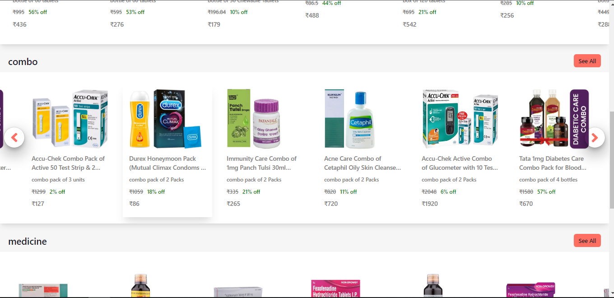

<h1 align="center">1mg Clone</h1>

<h3 align="center">It's a React and JSON server based E-commerce web application with all the major functionalities</h3>

<br />

<h2 align="center">🖥️ Tech Stack</h2>


<h4 align="center">Frontend:</h4>

<p align="center">
  
  
  
  
  
</p>


<h4 align="center">Backend:</h4>

<p align="center">
  
</p>

<h4 align="center">Deployed On:</h4>

<p align="center">
  
  
</p>


<h3 align="center"><a href="https://capsule-six.vercel.app/"><strong>Want to see live preview »</strong></a></h3>

<p align="center">
  <br />&#10023;
  <a href="https://github.com/AshokPrjapati/Capsule-1mg_clone/issues">Report Bug</a> &#10023;
  <a href="#Getting-Started">Getting Started</a> &#10023; 
  <a href="#contact">Author</a> &#10023;
</p>


Capsule is e-commerce web application that allows you to buy medicine & health products online. It has a variety of categories, just visit the product listing page and you will see all the products, apply filters as per your need and in just a few clicks you can see the details of any products from the website and can also add to cart. You can also apply coupan `CAPSULE10` for getting 10% discount on total price.This project is just for educational purpose.


<br />

## Screens ( All screens are responsive along with Dark Mode)
- Homepage / Landing Page
- Product Listing Page with Filters
- Product Description Page
- Cart Management Page
- Login / Logout Page
- Signup Page


<br />


## 🚀 Features
- Login and Signup User Account 
- Product Filters Based on Price, Category, Discount
- Product Sorting Based on Price, Rating
- Product Filtering and Sorting works together 
- Cart Add and Remove Items 
- Cart Update Quantities 
- Coupons provided for discount

<br />

## Glimpses of Capsule 🙈 :


<table>
  <tr>
    <td></td>
    <td></td>
  </tr>
  <tr>
    <td></td>
    <td></td>

  </tr>
  <tr>
    <td></td>
    <td></td>
  </tr>
  <tr>
    <td></td>
    <td></td>
  </tr>
  <tr>
    <td></td>
    <td></td>
  </tr>
  <tr>
       <td></td>
  </tr>
</table>

<br />

## Test Coupon Codes
```
CAPSULE10 (for 10% Off)
```

<!-- 
<h2 id="#demo">Demo</h2>

[Click here to see the presentation video of this project]()


<br /> -->

<h2 id="Getting-Started">Getting Started</h2>

This project was built using React,Chakra UI, HTML, CSS, JavaScript. It is an e-commerce web application and for running on your local environment you should follow these guidelines.


### Prerequisites

- NPM
- Node JS

### Setup


The project repository can be found in [GitHub link](https://github.com/AshokPrjapati/Capsule-1mg_clone) or just clone the project using this command.


```
Using HTTPS

# git clone https://github.com/AshokPrjapati/Capsule-1mg_clone.git
```

+ Open terminal on your workspace with

```
cd /home/workspace/Capsule-1mg_clone
```


## Install

Install NPM

Check that you have node and npm installed

To check if you have Node.js installed, run this command in your terminal:


```
node -v
```

To confirm that you have npm installed you can run this command in your terminal:


```
npm -v
```


To install all the dependencies of the project, run the following command:


```
npm install

```


To run the application run the following command:

```
npm start
```


### Tools used on this project

- Visual Studio Code
- create-react-app template

<br />


<h2 id="contact">Contact</h2>

If you want to contact me, you can reach me through below handles.

[](https://www.linkedin.com/in/ashok-kumar-1778b213b)
[](https://github.com/AshokPrjapati/)

© 2023 Ashok Kumar


## Show your support

Give a ⭐️ if you like this project!


